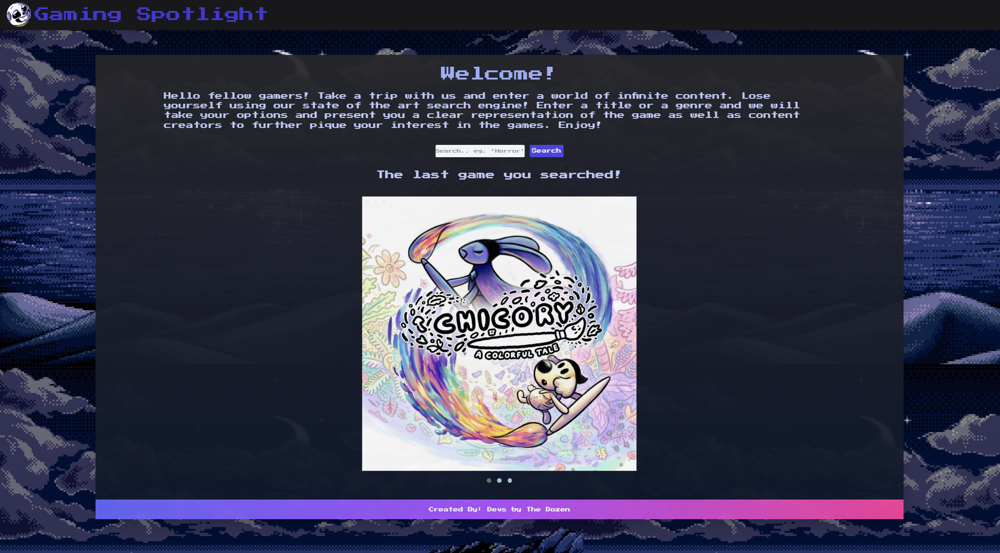
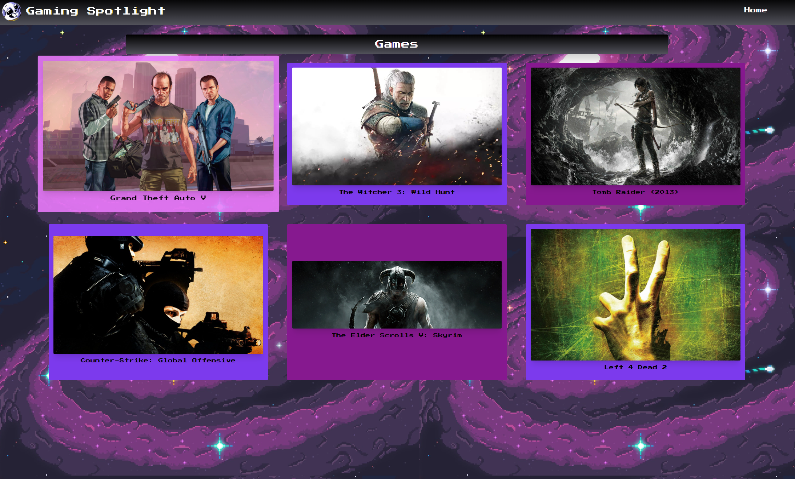
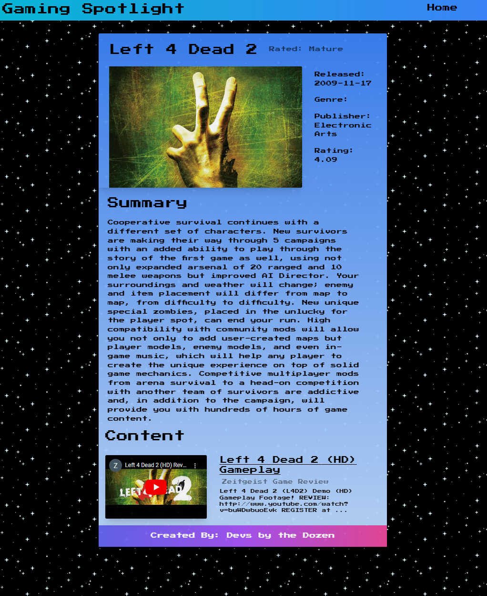

# Indie Developer Spotlight

## User Story

```
AS am indie games connoisseur,
I WANT to see indie games, and content related to the game
SO THAT I can plan my gaming purchases accordingly
```

## Acceptance Criteria

```
WHEN I launch the page upon startup, I will be presented with previously
searched for games. (this will be a future feature)
THEN I will be able to click on the game, in order to see its game
info (this will be a future feature)
WHEN I search for a game, by selecting a genre.
THEN I am presented with a list of games from the genre I have selected
WHEN I click on a particular title
THEN I am presented with a detailed view of the game, that also displays youtube content.
```

## Technologies used

```
Framework: Tailwind CSS
API #1: rawG
API#2: youtube
```

## Mock-Up

The following image shows the web application's appearance and functionality:




## GitHub Contributors

```
Dev's by the Dozen
Gustavo Rivera: https://github.com/IvaTheKing
Steven DePauw: https://github.com/stevendepauw
Fayane Jean: https://github.com/Fayane17
Nicholas Tozzi: https://github.com/NicholasTozzi
Alexander Brenes-Pimentel: https://github.com/alexbrenes999
```

## GitHub Pages link

https://alexbrenes999.github.io/project1/
...
